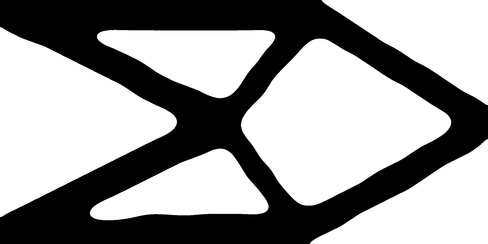

# Smoothinator

Smoothinator is a program that can upscale low resolution gray-scale images using curve fitting.
The curve fitting is done by the [fitCurves](https://github.com/volkerp/fitCurves) program,
which is a python implementation of Philip J. Schneider's "Algorithm for Automatically Fitting Digitized Curves", where I have modified the code to suit my needs.

I made this program to try to upscale the results from my topology optimizer [topomax](https://github.com/Emilinya/topomax), but I would not really call it a success yet.

## Example

### Input
<figure>
    
    <figcaption>Low quality cantilever from topology optimizer</figcaption>
</figure>

### Output
<figure>
    
    <figcaption>Smoothened version of cantilever</figcaption>
</figure>
